<!-- markdownlint-capture -->
<!-- markdownlint-disable -->

# Code Metrics

This file is dynamically maintained by a bot, *please do not* edit this by hand. It represents various [code metrics](https://aka.ms/dotnet/code-metrics), such as cyclomatic complexity, maintainability index, and so on.

<div id='atelierstore-web'></div>

## AtelierStore.Web :heavy_check_mark:

The *AtelierStore.Web.csproj* project file contains:

- 5 namespaces.
- 16 named types.
- 1,318 total lines of source code.
- Approximately 230 lines of executable code.
- The highest cyclomatic complexity is 4 :heavy_check_mark:.

<details>
<summary>
  <strong id="global+namespace">
    &lt;global namespace&gt; :heavy_check_mark:
  </strong>
</summary>
<br>

The `<global namespace>` namespace contains 1 named types.

- 1 named types.
- 82 total lines of source code.
- Approximately 70 lines of executable code.
- The highest cyclomatic complexity is 4 :heavy_check_mark:.

<details>
<summary>
  <strong id="program$">
    &lt;Program&gt;$ :heavy_check_mark:
  </strong>
</summary>
<br>

- The `<Program>$` contains 1 members.
- 82 total lines of source code.
- Approximately 70 lines of executable code.
- The highest cyclomatic complexity is 4 :heavy_check_mark:.

| Member kind | Line number | Maintainability index | Cyclomatic complexity | Depth of inheritance | Class coupling | Lines of source / executable code |
| :-: | :-: | :-: | :-: | :-: | :-: | :-: |
| Method | <a href='https://github.com/mpaulosky/atelier-store/blob/main/src/AtelierStore.Web/Program.cs#L1' title='<top-level-statements-entry-point>'>1</a> | 48 | 4 :heavy_check_mark: | 0 | 8 | 82 / 35 |

<a href="#global+namespace">:top: back to &lt;global namespace&gt;</a>

</details>

</details>

<details>
<summary>
  <strong id="atelierstore-web-account">
    AtelierStore.Web.Account :heavy_check_mark:
  </strong>
</summary>
<br>

The `AtelierStore.Web.Account` namespace contains 1 named types.

- 1 named types.
- 13 total lines of source code.
- Approximately 1 lines of executable code.
- The highest cyclomatic complexity is 4 :heavy_check_mark:.

<details>
<summary>
  <strong id="returnurl">
    ReturnUrl :heavy_check_mark:
  </strong>
</summary>
<br>

- The `ReturnUrl` contains 1 members.
- 10 total lines of source code.
- Approximately 1 lines of executable code.
- The highest cyclomatic complexity is 4 :heavy_check_mark:.

| Member kind | Line number | Maintainability index | Cyclomatic complexity | Depth of inheritance | Class coupling | Lines of source / executable code |
| :-: | :-: | :-: | :-: | :-: | :-: | :-: |
| Method | <a href='https://github.com/mpaulosky/atelier-store/blob/main/src/AtelierStore.Web/Account/ReturnUrl.cs#L12' title='bool ReturnUrl.IsLocal(string? url)'>12</a> | 87 | 4 :heavy_check_mark: | 0 | 4 | 6 / 1 |

<a href="#ReturnUrl-class-diagram">:link: to `ReturnUrl` class diagram</a>

<a href="#atelierstore-web-account">:top: back to AtelierStore.Web.Account</a>

</details>

</details>

<details>
<summary>
  <strong id="atelierstore-web-catalog">
    AtelierStore.Web.Catalog :heavy_check_mark:
  </strong>
</summary>
<br>

The `AtelierStore.Web.Catalog` namespace contains 7 named types.

- 7 named types.
- 126 total lines of source code.
- Approximately 21 lines of executable code.
- The highest cyclomatic complexity is 2 :heavy_check_mark:.

<details>
<summary>
  <strong id="collection">
    Collection :heavy_check_mark:
  </strong>
</summary>
<br>

- The `Collection` contains 5 members.
- 1 total lines of source code.
- Approximately 0 lines of executable code.
- The highest cyclomatic complexity is 1 :heavy_check_mark:.

| Member kind | Line number | Maintainability index | Cyclomatic complexity | Depth of inheritance | Class coupling | Lines of source / executable code |
| :-: | :-: | :-: | :-: | :-: | :-: | :-: |
| Method | <a href='https://github.com/mpaulosky/atelier-store/blob/main/src/AtelierStore.Web/Catalog/CatalogModels.cs#L32' title='Collection.Collection(string Slug, string Title, string Kicker, string ImageId)'>32</a> | 100 | 1 :heavy_check_mark: | 0 | 0 | 1 / 0 |
| Property | <a href='https://github.com/mpaulosky/atelier-store/blob/main/src/AtelierStore.Web/Catalog/CatalogModels.cs#L32' title='string Collection.ImageId'>32</a> | 100 | 0 :heavy_check_mark: | 0 | 0 | 1 / 0 |
| Property | <a href='https://github.com/mpaulosky/atelier-store/blob/main/src/AtelierStore.Web/Catalog/CatalogModels.cs#L32' title='string Collection.Kicker'>32</a> | 100 | 0 :heavy_check_mark: | 0 | 0 | 1 / 0 |
| Property | <a href='https://github.com/mpaulosky/atelier-store/blob/main/src/AtelierStore.Web/Catalog/CatalogModels.cs#L32' title='string Collection.Slug'>32</a> | 100 | 0 :heavy_check_mark: | 0 | 0 | 1 / 0 |
| Property | <a href='https://github.com/mpaulosky/atelier-store/blob/main/src/AtelierStore.Web/Catalog/CatalogModels.cs#L32' title='string Collection.Title'>32</a> | 100 | 0 :heavy_check_mark: | 0 | 0 | 1 / 0 |

<a href="#Collection-class-diagram">:link: to `Collection` class diagram</a>

<a href="#atelierstore-web-catalog">:top: back to AtelierStore.Web.Catalog</a>

</details>

<details>
<summary>
  <strong id="editorialcontent">
    EditorialContent :heavy_check_mark:
  </strong>
</summary>
<br>

- The `EditorialContent` contains 1 members.
- 14 total lines of source code.
- Approximately 1 lines of executable code.
- The highest cyclomatic complexity is 1 :heavy_check_mark:.

| Member kind | Line number | Maintainability index | Cyclomatic complexity | Depth of inheritance | Class coupling | Lines of source / executable code |
| :-: | :-: | :-: | :-: | :-: | :-: | :-: |
| Property | <a href='https://github.com/mpaulosky/atelier-store/blob/main/src/AtelierStore.Web/Catalog/CatalogModels.cs#L40' title='IReadOnlyList<Collection> EditorialContent.FeaturedCollections'>40</a> | 100 | 1 :heavy_check_mark: | 0 | 3 | 7 / 1 |

<a href="#EditorialContent-class-diagram">:link: to `EditorialContent` class diagram</a>

<a href="#atelierstore-web-catalog">:top: back to AtelierStore.Web.Catalog</a>

</details>

<details>
<summary>
  <strong id="iproductcatalog">
    IProductCatalog :heavy_check_mark:
  </strong>
</summary>
<br>

- The `IProductCatalog` contains 3 members.
- 12 total lines of source code.
- Approximately 6 lines of executable code.
- The highest cyclomatic complexity is 1 :heavy_check_mark:.

| Member kind | Line number | Maintainability index | Cyclomatic complexity | Depth of inheritance | Class coupling | Lines of source / executable code |
| :-: | :-: | :-: | :-: | :-: | :-: | :-: |
| Method | <a href='https://github.com/mpaulosky/atelier-store/blob/main/src/AtelierStore.Web/Catalog/IProductCatalog.cs#L10' title='Task<Product?> IProductCatalog.FindBySlugAsync(string slug, CancellationToken cancellationToken = null)'>10</a> | 87 | 1 :heavy_check_mark: | 0 | 3 | 2 / 2 |
| Method | <a href='https://github.com/mpaulosky/atelier-store/blob/main/src/AtelierStore.Web/Catalog/IProductCatalog.cs#L7' title='Task<IReadOnlyList<Product>> IProductCatalog.GetNewArrivalsAsync(int count, CancellationToken cancellationToken = null)'>7</a> | 87 | 1 :heavy_check_mark: | 0 | 4 | 2 / 2 |
| Method | <a href='https://github.com/mpaulosky/atelier-store/blob/main/src/AtelierStore.Web/Catalog/IProductCatalog.cs#L13' title='Task<IReadOnlyList<Product>> IProductCatalog.GetRelatedAsync(string slug, int count, CancellationToken cancellationToken = null)'>13</a> | 87 | 1 :heavy_check_mark: | 0 | 4 | 2 / 2 |

<a href="#IProductCatalog-class-diagram">:link: to `IProductCatalog` class diagram</a>

<a href="#atelierstore-web-catalog">:top: back to AtelierStore.Web.Catalog</a>

</details>

<details>
<summary>
  <strong id="product">
    Product :heavy_check_mark:
  </strong>
</summary>
<br>

- The `Product` contains 12 members.
- 21 total lines of source code.
- Approximately 11 lines of executable code.
- The highest cyclomatic complexity is 2 :heavy_check_mark:.

| Member kind | Line number | Maintainability index | Cyclomatic complexity | Depth of inheritance | Class coupling | Lines of source / executable code |
| :-: | :-: | :-: | :-: | :-: | :-: | :-: |
| Method | <a href='https://github.com/mpaulosky/atelier-store/blob/main/src/AtelierStore.Web/Catalog/CatalogModels.cs#L3' title='Product.Product(string Slug, string Name, string Category, decimal Price, string ImageId, string Description, int Stock, string? Badge = null, decimal? WasPrice = null)'>3</a> | 80 | 1 :heavy_check_mark: | 0 | 2 | 21 / 4 |
| Property | <a href='https://github.com/mpaulosky/atelier-store/blob/main/src/AtelierStore.Web/Catalog/CatalogModels.cs#L11' title='string? Product.Badge'>11</a> | 100 | 0 :heavy_check_mark: | 0 | 1 | 1 / 1 |
| Property | <a href='https://github.com/mpaulosky/atelier-store/blob/main/src/AtelierStore.Web/Catalog/CatalogModels.cs#L6' title='string Product.Category'>6</a> | 100 | 0 :heavy_check_mark: | 0 | 0 | 1 / 0 |
| Property | <a href='https://github.com/mpaulosky/atelier-store/blob/main/src/AtelierStore.Web/Catalog/CatalogModels.cs#L9' title='string Product.Description'>9</a> | 100 | 0 :heavy_check_mark: | 0 | 0 | 1 / 0 |
| Property | <a href='https://github.com/mpaulosky/atelier-store/blob/main/src/AtelierStore.Web/Catalog/CatalogModels.cs#L8' title='string Product.ImageId'>8</a> | 100 | 0 :heavy_check_mark: | 0 | 0 | 1 / 0 |
| Field | <a href='https://github.com/mpaulosky/atelier-store/blob/main/src/AtelierStore.Web/Catalog/CatalogModels.cs#L15' title='int Product.LowStockThreshold'>15</a> | 93 | 0 :heavy_check_mark: | 0 | 0 | 1 / 1 |
| Property | <a href='https://github.com/mpaulosky/atelier-store/blob/main/src/AtelierStore.Web/Catalog/CatalogModels.cs#L5' title='string Product.Name'>5</a> | 100 | 0 :heavy_check_mark: | 0 | 0 | 1 / 0 |
| Property | <a href='https://github.com/mpaulosky/atelier-store/blob/main/src/AtelierStore.Web/Catalog/CatalogModels.cs#L7' title='decimal Product.Price'>7</a> | 100 | 0 :heavy_check_mark: | 0 | 1 | 1 / 0 |
| Property | <a href='https://github.com/mpaulosky/atelier-store/blob/main/src/AtelierStore.Web/Catalog/CatalogModels.cs#L4' title='string Product.Slug'>4</a> | 100 | 0 :heavy_check_mark: | 0 | 0 | 1 / 0 |
| Property | <a href='https://github.com/mpaulosky/atelier-store/blob/main/src/AtelierStore.Web/Catalog/CatalogModels.cs#L10' title='int Product.Stock'>10</a> | 100 | 0 :heavy_check_mark: | 0 | 0 | 1 / 0 |
| Property | <a href='https://github.com/mpaulosky/atelier-store/blob/main/src/AtelierStore.Web/Catalog/CatalogModels.cs#L17' title='StockState Product.StockState'>17</a> | 91 | 2 :heavy_check_mark: | 0 | 1 | 6 / 2 |
| Property | <a href='https://github.com/mpaulosky/atelier-store/blob/main/src/AtelierStore.Web/Catalog/CatalogModels.cs#L12' title='decimal? Product.WasPrice'>12</a> | 100 | 0 :heavy_check_mark: | 0 | 2 | 1 / 1 |

<a href="#Product-class-diagram">:link: to `Product` class diagram</a>

<a href="#atelierstore-web-catalog">:top: back to AtelierStore.Web.Catalog</a>

</details>

<details>
<summary>
  <strong id="productcatalog">
    ProductCatalog :question:
  </strong>
</summary>
<br>

- The `ProductCatalog` contains 0 members.
- 2 total lines of source code.
- Approximately 0 lines of executable code.
- The highest cyclomatic complexity is 0 :question:.

| Member kind | Line number | Maintainability index | Cyclomatic complexity | Depth of inheritance | Class coupling | Lines of source / executable code |
| :-: | :-: | :-: | :-: | :-: | :-: | :-: |

<a href="#ProductCatalog-class-diagram">:link: to `ProductCatalog` class diagram</a>

<a href="#atelierstore-web-catalog">:top: back to AtelierStore.Web.Catalog</a>

</details>

<details>
<summary>
  <strong id="stockstate">
    StockState :heavy_check_mark:
  </strong>
</summary>
<br>

- The `StockState` contains 3 members.
- 6 total lines of source code.
- Approximately 0 lines of executable code.
- The highest cyclomatic complexity is 0 :heavy_check_mark:.

| Member kind | Line number | Maintainability index | Cyclomatic complexity | Depth of inheritance | Class coupling | Lines of source / executable code |
| :-: | :-: | :-: | :-: | :-: | :-: | :-: |
| Field | <a href='https://github.com/mpaulosky/atelier-store/blob/main/src/AtelierStore.Web/Catalog/CatalogModels.cs#L27' title='StockState.InStock'>27</a> | 100 | 0 :heavy_check_mark: | 0 | 0 | 1 / 0 |
| Field | <a href='https://github.com/mpaulosky/atelier-store/blob/main/src/AtelierStore.Web/Catalog/CatalogModels.cs#L28' title='StockState.LowStock'>28</a> | 100 | 0 :heavy_check_mark: | 0 | 0 | 1 / 0 |
| Field | <a href='https://github.com/mpaulosky/atelier-store/blob/main/src/AtelierStore.Web/Catalog/CatalogModels.cs#L29' title='StockState.SoldOut'>29</a> | 100 | 0 :heavy_check_mark: | 0 | 0 | 1 / 0 |

<a href="#StockState-class-diagram">:link: to `StockState` class diagram</a>

<a href="#atelierstore-web-catalog">:top: back to AtelierStore.Web.Catalog</a>

</details>

<details>
<summary>
  <strong id="unsplashimage">
    UnsplashImage :heavy_check_mark:
  </strong>
</summary>
<br>

- The `UnsplashImage` contains 2 members.
- 10 total lines of source code.
- Approximately 3 lines of executable code.
- The highest cyclomatic complexity is 1 :heavy_check_mark:.

| Member kind | Line number | Maintainability index | Cyclomatic complexity | Depth of inheritance | Class coupling | Lines of source / executable code |
| :-: | :-: | :-: | :-: | :-: | :-: | :-: |
| Method | <a href='https://github.com/mpaulosky/atelier-store/blob/main/src/AtelierStore.Web/Catalog/CatalogModels.cs#L56' title='string UnsplashImage.SrcSet(string imageId, params int[] widths)'>56</a> | 86 | 1 :heavy_check_mark: | 0 | 1 | 3 / 2 |
| Method | <a href='https://github.com/mpaulosky/atelier-store/blob/main/src/AtelierStore.Web/Catalog/CatalogModels.cs#L52' title='string UnsplashImage.Url(string imageId, int width)'>52</a> | 97 | 1 :heavy_check_mark: | 0 | 0 | 3 / 1 |

<a href="#UnsplashImage-class-diagram">:link: to `UnsplashImage` class diagram</a>

<a href="#atelierstore-web-catalog">:top: back to AtelierStore.Web.Catalog</a>

</details>

</details>

<details>
<summary>
  <strong id="atelierstore-web-data">
    AtelierStore.Web.Data :heavy_check_mark:
  </strong>
</summary>
<br>

The `AtelierStore.Web.Data` namespace contains 5 named types.

- 5 named types.
- 198 total lines of source code.
- Approximately 8 lines of executable code.
- The highest cyclomatic complexity is 2 :heavy_check_mark:.

<details>
<summary>
  <strong id="appdbcontext">
    AppDbContext :question:
  </strong>
</summary>
<br>

- The `AppDbContext` contains 0 members.
- 1 total lines of source code.
- Approximately 0 lines of executable code.
- The highest cyclomatic complexity is 0 :question:.

| Member kind | Line number | Maintainability index | Cyclomatic complexity | Depth of inheritance | Class coupling | Lines of source / executable code |
| :-: | :-: | :-: | :-: | :-: | :-: | :-: |

<a href="#AppDbContext-class-diagram">:link: to `AppDbContext` class diagram</a>

<a href="#atelierstore-web-data">:top: back to AtelierStore.Web.Data</a>

</details>

<details>
<summary>
  <strong id="catalogseeddata">
    CatalogSeedData :heavy_check_mark:
  </strong>
</summary>
<br>

- The `CatalogSeedData` contains 4 members.
- 84 total lines of source code.
- Approximately 4 lines of executable code.
- The highest cyclomatic complexity is 1 :heavy_check_mark:.

| Member kind | Line number | Maintainability index | Cyclomatic complexity | Depth of inheritance | Class coupling | Lines of source / executable code |
| :-: | :-: | :-: | :-: | :-: | :-: | :-: |
| Property | <a href='https://github.com/mpaulosky/atelier-store/blob/main/src/AtelierStore.Web/Data/CatalogSeedData.cs#L12' title='Category[] CatalogSeedData.Categories'>12</a> | 100 | 1 :heavy_check_mark: | 0 | 2 | 10 / 1 |
| Property | <a href='https://github.com/mpaulosky/atelier-store/blob/main/src/AtelierStore.Web/Data/CatalogSeedData.cs#L23' title='Product[] CatalogSeedData.Products'>23</a> | 100 | 1 :heavy_check_mark: | 0 | 4 | 51 / 1 |
| Field | <a href='https://github.com/mpaulosky/atelier-store/blob/main/src/AtelierStore.Web/Data/CatalogSeedData.cs#L10' title='DateTimeOffset CatalogSeedData.SeededAt'>10</a> | 86 | 0 :heavy_check_mark: | 0 | 2 | 1 / 1 |
| Property | <a href='https://github.com/mpaulosky/atelier-store/blob/main/src/AtelierStore.Web/Data/CatalogSeedData.cs#L75' title='ProductStock[] CatalogSeedData.Stock'>75</a> | 100 | 1 :heavy_check_mark: | 0 | 3 | 11 / 1 |

<a href="#CatalogSeedData-class-diagram">:link: to `CatalogSeedData` class diagram</a>

<a href="#atelierstore-web-data">:top: back to AtelierStore.Web.Data</a>

</details>

<details>
<summary>
  <strong id="category">
    Category :heavy_check_mark:
  </strong>
</summary>
<br>

- The `Category` contains 4 members.
- 11 total lines of source code.
- Approximately 1 lines of executable code.
- The highest cyclomatic complexity is 2 :heavy_check_mark:.

| Member kind | Line number | Maintainability index | Cyclomatic complexity | Depth of inheritance | Class coupling | Lines of source / executable code |
| :-: | :-: | :-: | :-: | :-: | :-: | :-: |
| Property | <a href='https://github.com/mpaulosky/atelier-store/blob/main/src/AtelierStore.Web/Data/Category.cs#L5' title='int Category.Id'>5</a> | 100 | 2 :heavy_check_mark: | 0 | 0 | 1 / 0 |
| Property | <a href='https://github.com/mpaulosky/atelier-store/blob/main/src/AtelierStore.Web/Data/Category.cs#L10' title='string Category.Name'>10</a> | 100 | 2 :heavy_check_mark: | 0 | 0 | 1 / 0 |
| Property | <a href='https://github.com/mpaulosky/atelier-store/blob/main/src/AtelierStore.Web/Data/Category.cs#L12' title='List<Product> Category.Products'>12</a> | 100 | 2 :heavy_check_mark: | 0 | 3 | 1 / 1 |
| Property | <a href='https://github.com/mpaulosky/atelier-store/blob/main/src/AtelierStore.Web/Data/Category.cs#L8' title='string Category.Slug'>8</a> | 100 | 2 :heavy_check_mark: | 0 | 0 | 1 / 0 |

<a href="#Category-class-diagram">:link: to `Category` class diagram</a>

<a href="#atelierstore-web-data">:top: back to AtelierStore.Web.Data</a>

</details>

<details>
<summary>
  <strong id="product">
    Product :heavy_check_mark:
  </strong>
</summary>
<br>

- The `Product` contains 12 members.
- 29 total lines of source code.
- Approximately 2 lines of executable code.
- The highest cyclomatic complexity is 2 :heavy_check_mark:.

| Member kind | Line number | Maintainability index | Cyclomatic complexity | Depth of inheritance | Class coupling | Lines of source / executable code |
| :-: | :-: | :-: | :-: | :-: | :-: | :-: |
| Property | <a href='https://github.com/mpaulosky/atelier-store/blob/main/src/AtelierStore.Web/Data/Product.cs#L26' title='string? Product.Badge'>26</a> | 100 | 2 :heavy_check_mark: | 0 | 1 | 1 / 0 |
| Property | <a href='https://github.com/mpaulosky/atelier-store/blob/main/src/AtelierStore.Web/Data/Product.cs#L16' title='Category Product.Category'>16</a> | 100 | 2 :heavy_check_mark: | 0 | 1 | 1 / 1 |
| Property | <a href='https://github.com/mpaulosky/atelier-store/blob/main/src/AtelierStore.Web/Data/Product.cs#L14' title='int Product.CategoryId'>14</a> | 100 | 2 :heavy_check_mark: | 0 | 0 | 1 / 0 |
| Property | <a href='https://github.com/mpaulosky/atelier-store/blob/main/src/AtelierStore.Web/Data/Product.cs#L28' title='DateTimeOffset Product.CreatedAt'>28</a> | 100 | 2 :heavy_check_mark: | 0 | 1 | 1 / 0 |
| Property | <a href='https://github.com/mpaulosky/atelier-store/blob/main/src/AtelierStore.Web/Data/Product.cs#L12' title='string Product.Description'>12</a> | 100 | 2 :heavy_check_mark: | 0 | 0 | 1 / 0 |
| Property | <a href='https://github.com/mpaulosky/atelier-store/blob/main/src/AtelierStore.Web/Data/Product.cs#L5' title='int Product.Id'>5</a> | 100 | 2 :heavy_check_mark: | 0 | 0 | 1 / 0 |
| Property | <a href='https://github.com/mpaulosky/atelier-store/blob/main/src/AtelierStore.Web/Data/Product.cs#L24' title='string Product.ImageId'>24</a> | 100 | 2 :heavy_check_mark: | 0 | 0 | 1 / 0 |
| Property | <a href='https://github.com/mpaulosky/atelier-store/blob/main/src/AtelierStore.Web/Data/Product.cs#L10' title='string Product.Name'>10</a> | 100 | 2 :heavy_check_mark: | 0 | 0 | 1 / 0 |
| Property | <a href='https://github.com/mpaulosky/atelier-store/blob/main/src/AtelierStore.Web/Data/Product.cs#L18' title='decimal Product.Price'>18</a> | 100 | 2 :heavy_check_mark: | 0 | 1 | 1 / 0 |
| Property | <a href='https://github.com/mpaulosky/atelier-store/blob/main/src/AtelierStore.Web/Data/Product.cs#L8' title='string Product.Slug'>8</a> | 100 | 2 :heavy_check_mark: | 0 | 0 | 1 / 0 |
| Property | <a href='https://github.com/mpaulosky/atelier-store/blob/main/src/AtelierStore.Web/Data/Product.cs#L30' title='ProductStock Product.Stock'>30</a> | 100 | 2 :heavy_check_mark: | 0 | 1 | 1 / 1 |
| Property | <a href='https://github.com/mpaulosky/atelier-store/blob/main/src/AtelierStore.Web/Data/Product.cs#L21' title='decimal? Product.WasPrice'>21</a> | 100 | 2 :heavy_check_mark: | 0 | 2 | 2 / 0 |

<a href="#Product-class-diagram">:link: to `Product` class diagram</a>

<a href="#atelierstore-web-data">:top: back to AtelierStore.Web.Data</a>

</details>

<details>
<summary>
  <strong id="productstock">
    ProductStock :heavy_check_mark:
  </strong>
</summary>
<br>

- The `ProductStock` contains 4 members.
- 11 total lines of source code.
- Approximately 1 lines of executable code.
- The highest cyclomatic complexity is 2 :heavy_check_mark:.

| Member kind | Line number | Maintainability index | Cyclomatic complexity | Depth of inheritance | Class coupling | Lines of source / executable code |
| :-: | :-: | :-: | :-: | :-: | :-: | :-: |
| Property | <a href='https://github.com/mpaulosky/atelier-store/blob/main/src/AtelierStore.Web/Data/ProductStock.cs#L8' title='Product ProductStock.Product'>8</a> | 100 | 2 :heavy_check_mark: | 0 | 1 | 1 / 1 |
| Property | <a href='https://github.com/mpaulosky/atelier-store/blob/main/src/AtelierStore.Web/Data/ProductStock.cs#L6' title='int ProductStock.ProductId'>6</a> | 100 | 2 :heavy_check_mark: | 0 | 0 | 1 / 0 |
| Property | <a href='https://github.com/mpaulosky/atelier-store/blob/main/src/AtelierStore.Web/Data/ProductStock.cs#L10' title='int ProductStock.Quantity'>10</a> | 100 | 2 :heavy_check_mark: | 0 | 0 | 1 / 0 |
| Property | <a href='https://github.com/mpaulosky/atelier-store/blob/main/src/AtelierStore.Web/Data/ProductStock.cs#L12' title='DateTimeOffset ProductStock.UpdatedAt'>12</a> | 100 | 2 :heavy_check_mark: | 0 | 1 | 1 / 0 |

<a href="#ProductStock-class-diagram">:link: to `ProductStock` class diagram</a>

<a href="#atelierstore-web-data">:top: back to AtelierStore.Web.Data</a>

</details>

</details>

<details>
<summary>
  <strong id="atelierstore-web-migrations">
    AtelierStore.Web.Migrations :heavy_check_mark:
  </strong>
</summary>
<br>

The `AtelierStore.Web.Migrations` namespace contains 2 named types.

- 2 named types.
- 899 total lines of source code.
- Approximately 130 lines of executable code.
- The highest cyclomatic complexity is 1 :heavy_check_mark:.

<details>
<summary>
  <strong id="appdbcontextmodelsnapshot">
    AppDbContextModelSnapshot :heavy_check_mark:
  </strong>
</summary>
<br>

- The `AppDbContextModelSnapshot` contains 1 members.
- 368 total lines of source code.
- Approximately 50 lines of executable code.
- The highest cyclomatic complexity is 1 :heavy_check_mark:.

| Member kind | Line number | Maintainability index | Cyclomatic complexity | Depth of inheritance | Class coupling | Lines of source / executable code |
| :-: | :-: | :-: | :-: | :-: | :-: | :-: |
| Method | <a href='https://github.com/mpaulosky/atelier-store/blob/main/src/AtelierStore.Web/Migrations/AppDbContextModelSnapshot.cs#L16' title='void AppDbContextModelSnapshot.BuildModel(ModelBuilder modelBuilder)'>16</a> | 37 | 1 :heavy_check_mark: | 0 | 6 | 364 / 48 |

<a href="#AppDbContextModelSnapshot-class-diagram">:link: to `AppDbContextModelSnapshot` class diagram</a>

<a href="#atelierstore-web-migrations">:top: back to AtelierStore.Web.Migrations</a>

</details>

<details>
<summary>
  <strong id="initialcatalog">
    InitialCatalog :heavy_check_mark:
  </strong>
</summary>
<br>

- The `InitialCatalog` contains 3 members.
- 514 total lines of source code.
- Approximately 80 lines of executable code.
- The highest cyclomatic complexity is 1 :heavy_check_mark:.

| Member kind | Line number | Maintainability index | Cyclomatic complexity | Depth of inheritance | Class coupling | Lines of source / executable code |
| :-: | :-: | :-: | :-: | :-: | :-: | :-: |
| Method | <a href='https://github.com/mpaulosky/atelier-store/blob/main/src/AtelierStore.Web/Migrations/20260926204023_InitialCatalog.Designer.cs#L19' title='void InitialCatalog.BuildTargetModel(ModelBuilder modelBuilder)'>19</a> | 37 | 1 :heavy_check_mark: | 0 | 6 | 365 / 48 |
| Method | <a href='https://github.com/mpaulosky/atelier-store/blob/main/src/AtelierStore.Web/Migrations/20260926204023_InitialCatalog.cs#L143' title='void InitialCatalog.Down(MigrationBuilder migrationBuilder)'>143</a> | 82 | 1 :heavy_check_mark: | 0 | 2 | 12 / 3 |
| Method | <a href='https://github.com/mpaulosky/atelier-store/blob/main/src/AtelierStore.Web/Migrations/20260926204023_InitialCatalog.cs#L15' title='void InitialCatalog.Up(MigrationBuilder migrationBuilder)'>15</a> | 44 | 1 :heavy_check_mark: | 0 | 6 | 127 / 25 |

<a href="#InitialCatalog-class-diagram">:link: to `InitialCatalog` class diagram</a>

<a href="#atelierstore-web-migrations">:top: back to AtelierStore.Web.Migrations</a>

</details>

</details>

<a href="#atelierstore-web">:top: back to AtelierStore.Web</a>

<div id='atelierstore-web-tests-bunit'></div>

## AtelierStore.Web.Tests.Bunit :heavy_check_mark:

The *AtelierStore.Web.Tests.Bunit.csproj* project file contains:

- 1 namespaces.
- 6 named types.
- 328 total lines of source code.
- Approximately 117 lines of executable code.
- The highest cyclomatic complexity is 1 :heavy_check_mark:.

<details>
<summary>
  <strong id="atelierstore-web-tests-bunit">
    AtelierStore.Web.Tests.Bunit :heavy_check_mark:
  </strong>
</summary>
<br>

The `AtelierStore.Web.Tests.Bunit` namespace contains 6 named types.

- 6 named types.
- 328 total lines of source code.
- Approximately 117 lines of executable code.
- The highest cyclomatic complexity is 1 :heavy_check_mark:.

<details>
<summary>
  <strong id="hometests">
    HomeTests :heavy_check_mark:
  </strong>
</summary>
<br>

- The `HomeTests` contains 2 members.
- 41 total lines of source code.
- Approximately 12 lines of executable code.
- The highest cyclomatic complexity is 1 :heavy_check_mark:.

| Member kind | Line number | Maintainability index | Cyclomatic complexity | Depth of inheritance | Class coupling | Lines of source / executable code |
| :-: | :-: | :-: | :-: | :-: | :-: | :-: |
| Method | <a href='https://github.com/mpaulosky/atelier-store/blob/main/tests/AtelierStore.Web.Tests.Bunit/HomeTests.cs#L33' title='void HomeTests.Home_Rendered_NewsletterFormDefersEmailValidationToTheServer()'>33</a> | 72 | 1 :heavy_check_mark: | 0 | 5 | 17 / 6 |
| Method | <a href='https://github.com/mpaulosky/atelier-store/blob/main/tests/AtelierStore.Web.Tests.Bunit/HomeTests.cs#L12' title='void HomeTests.Home_Rendered_ShowsOneCardPerNewArrival()'>12</a> | 69 | 1 :heavy_check_mark: | 0 | 10 | 20 / 6 |

<a href="#HomeTests-class-diagram">:link: to `HomeTests` class diagram</a>

<a href="#atelierstore-web-tests-bunit">:top: back to AtelierStore.Web.Tests.Bunit</a>

</details>

<details>
<summary>
  <strong id="productcardtests">
    ProductCardTests :heavy_check_mark:
  </strong>
</summary>
<br>

- The `ProductCardTests` contains 4 members.
- 59 total lines of source code.
- Approximately 21 lines of executable code.
- The highest cyclomatic complexity is 1 :heavy_check_mark:.

| Member kind | Line number | Maintainability index | Cyclomatic complexity | Depth of inheritance | Class coupling | Lines of source / executable code |
| :-: | :-: | :-: | :-: | :-: | :-: | :-: |
| Method | <a href='https://github.com/mpaulosky/atelier-store/blob/main/tests/AtelierStore.Web.Tests.Bunit/ProductCardTests.cs#L25' title='void ProductCardTests.ProductCard_InStockWithBadge_ShowsBadge()'>25</a> | 74 | 1 :heavy_check_mark: | 0 | 5 | 13 / 5 |
| Method | <a href='https://github.com/mpaulosky/atelier-store/blob/main/tests/AtelierStore.Web.Tests.Bunit/ProductCardTests.cs#L39' title='void ProductCardTests.ProductCard_InStockWithoutBadge_RendersNoBadge()'>39</a> | 74 | 1 :heavy_check_mark: | 0 | 8 | 13 / 5 |
| Method | <a href='https://github.com/mpaulosky/atelier-store/blob/main/tests/AtelierStore.Web.Tests.Bunit/ProductCardTests.cs#L53' title='void ProductCardTests.ProductCard_Rendered_LinksToProductDetailPage()'>53</a> | 73 | 1 :heavy_check_mark: | 0 | 8 | 13 / 5 |
| Method | <a href='https://github.com/mpaulosky/atelier-store/blob/main/tests/AtelierStore.Web.Tests.Bunit/ProductCardTests.cs#L10' title='void ProductCardTests.ProductCard_SoldOutWithBadge_ShowsSoldOutInsteadOfBadge()'>10</a> | 72 | 1 :heavy_check_mark: | 0 | 5 | 14 / 6 |

<a href="#ProductCardTests-class-diagram">:link: to `ProductCardTests` class diagram</a>

<a href="#atelierstore-web-tests-bunit">:top: back to AtelierStore.Web.Tests.Bunit</a>

</details>

<details>
<summary>
  <strong id="productdetailtests">
    ProductDetailTests :heavy_check_mark:
  </strong>
</summary>
<br>

- The `ProductDetailTests` contains 11 members.
- 126 total lines of source code.
- Approximately 45 lines of executable code.
- The highest cyclomatic complexity is 1 :heavy_check_mark:.

| Member kind | Line number | Maintainability index | Cyclomatic complexity | Depth of inheritance | Class coupling | Lines of source / executable code |
| :-: | :-: | :-: | :-: | :-: | :-: | :-: |
| Method | <a href='https://github.com/mpaulosky/atelier-store/blob/main/tests/AtelierStore.Web.Tests.Bunit/ProductDetailTests.cs#L15' title='ProductDetailTests.ProductDetailTests()'>15</a> | 100 | 1 :heavy_check_mark: | 0 | 2 | 1 / 1 |
| Method | <a href='https://github.com/mpaulosky/atelier-store/blob/main/tests/AtelierStore.Web.Tests.Bunit/ProductDetailTests.cs#L128' title='void ProductDetailTests.ArrangeCatalog(Product product)'>128</a> | 86 | 1 :heavy_check_mark: | 0 | 3 | 5 / 2 |
| Field | <a href='https://github.com/mpaulosky/atelier-store/blob/main/tests/AtelierStore.Web.Tests.Bunit/ProductDetailTests.cs#L13' title='IProductCatalog ProductDetailTests.catalog'>13</a> | 93 | 0 :heavy_check_mark: | 0 | 2 | 1 / 1 |
| Method | <a href='https://github.com/mpaulosky/atelier-store/blob/main/tests/AtelierStore.Web.Tests.Bunit/ProductDetailTests.cs#L18' title='void ProductDetailTests.ProductDetail_InStock_ShowsInStockLabel()'>18</a> | 77 | 1 :heavy_check_mark: | 0 | 8 | 13 / 4 |
| Method | <a href='https://github.com/mpaulosky/atelier-store/blob/main/tests/AtelierStore.Web.Tests.Bunit/ProductDetailTests.cs#L78' title='void ProductDetailTests.ProductDetail_InStockWithBadge_RendersBadge()'>78</a> | 77 | 1 :heavy_check_mark: | 0 | 5 | 13 / 4 |
| Method | <a href='https://github.com/mpaulosky/atelier-store/blob/main/tests/AtelierStore.Web.Tests.Bunit/ProductDetailTests.cs#L32' title='void ProductDetailTests.ProductDetail_LowStock_ShowsRemainingUnitCount()'>32</a> | 76 | 1 :heavy_check_mark: | 0 | 6 | 13 / 4 |
| Method | <a href='https://github.com/mpaulosky/atelier-store/blob/main/tests/AtelierStore.Web.Tests.Bunit/ProductDetailTests.cs#L108' title='void ProductDetailTests.ProductDetail_Rendered_ShowsRelatedProductsAsCards()'>108</a> | 67 | 1 :heavy_check_mark: | 0 | 9 | 20 / 7 |
| Method | <a href='https://github.com/mpaulosky/atelier-store/blob/main/tests/AtelierStore.Web.Tests.Bunit/ProductDetailTests.cs#L46' title='void ProductDetailTests.ProductDetail_SoldOut_ShowsSoldOutLabelAndDisabledButtonAndReturnNotice()'>46</a> | 67 | 1 :heavy_check_mark: | 0 | 8 | 17 / 8 |
| Method | <a href='https://github.com/mpaulosky/atelier-store/blob/main/tests/AtelierStore.Web.Tests.Bunit/ProductDetailTests.cs#L64' title='void ProductDetailTests.ProductDetail_SoldOutWithBadge_RendersNoBadge()'>64</a> | 78 | 1 :heavy_check_mark: | 0 | 5 | 13 / 4 |
| Method | <a href='https://github.com/mpaulosky/atelier-store/blob/main/tests/AtelierStore.Web.Tests.Bunit/ProductDetailTests.cs#L92' title='void ProductDetailTests.ProductDetail_UnknownSlug_RaisesNotFound()'>92</a> | 69 | 1 :heavy_check_mark: | 0 | 8 | 15 / 7 |
| Method | <a href='https://github.com/mpaulosky/atelier-store/blob/main/tests/AtelierStore.Web.Tests.Bunit/ProductDetailTests.cs#L134' title='IRenderedComponent<ProductDetail> ProductDetailTests.RenderDetail(string slug)'>134</a> | 85 | 1 :heavy_check_mark: | 0 | 3 | 2 / 3 |

<a href="#ProductDetailTests-class-diagram">:link: to `ProductDetailTests` class diagram</a>

<a href="#atelierstore-web-tests-bunit">:top: back to AtelierStore.Web.Tests.Bunit</a>

</details>

<details>
<summary>
  <strong id="productpricetests">
    ProductPriceTests :heavy_check_mark:
  </strong>
</summary>
<br>

- The `ProductPriceTests` contains 2 members.
- 34 total lines of source code.
- Approximately 14 lines of executable code.
- The highest cyclomatic complexity is 1 :heavy_check_mark:.

| Member kind | Line number | Maintainability index | Cyclomatic complexity | Depth of inheritance | Class coupling | Lines of source / executable code |
| :-: | :-: | :-: | :-: | :-: | :-: | :-: |
| Method | <a href='https://github.com/mpaulosky/atelier-store/blob/main/tests/AtelierStore.Web.Tests.Bunit/ProductPriceTests.cs#L25' title='void ProductPriceTests.ProductPrice_OnSale_RendersSalePriceAndStruckThroughWasPrice()'>25</a> | 67 | 1 :heavy_check_mark: | 0 | 8 | 16 / 8 |
| Method | <a href='https://github.com/mpaulosky/atelier-store/blob/main/tests/AtelierStore.Web.Tests.Bunit/ProductPriceTests.cs#L10' title='void ProductPriceTests.ProductPrice_RegularPrice_RendersFormattedAmount()'>10</a> | 72 | 1 :heavy_check_mark: | 0 | 8 | 14 / 6 |

<a href="#ProductPriceTests-class-diagram">:link: to `ProductPriceTests` class diagram</a>

<a href="#atelierstore-web-tests-bunit">:top: back to AtelierStore.Web.Tests.Bunit</a>

</details>

<details>
<summary>
  <strong id="siteheadertests">
    SiteHeaderTests :heavy_check_mark:
  </strong>
</summary>
<br>

- The `SiteHeaderTests` contains 2 members.
- 32 total lines of source code.
- Approximately 10 lines of executable code.
- The highest cyclomatic complexity is 1 :heavy_check_mark:.

| Member kind | Line number | Maintainability index | Cyclomatic complexity | Depth of inheritance | Class coupling | Lines of source / executable code |
| :-: | :-: | :-: | :-: | :-: | :-: | :-: |
| Method | <a href='https://github.com/mpaulosky/atelier-store/blob/main/tests/AtelierStore.Web.Tests.Bunit/SiteHeaderTests.cs#L10' title='void SiteHeaderTests.SiteHeader_AnonymousUser_ShowsLogInLink()'>10</a> | 74 | 1 :heavy_check_mark: | 0 | 5 | 14 / 5 |
| Method | <a href='https://github.com/mpaulosky/atelier-store/blob/main/tests/AtelierStore.Web.Tests.Bunit/SiteHeaderTests.cs#L25' title='void SiteHeaderTests.SiteHeader_SignedInUser_ShowsLogOutLink()'>25</a> | 74 | 1 :heavy_check_mark: | 0 | 5 | 14 / 5 |

<a href="#SiteHeaderTests-class-diagram">:link: to `SiteHeaderTests` class diagram</a>

<a href="#atelierstore-web-tests-bunit">:top: back to AtelierStore.Web.Tests.Bunit</a>

</details>

<details>
<summary>
  <strong id="testproducts">
    TestProducts :heavy_check_mark:
  </strong>
</summary>
<br>

- The `TestProducts` contains 3 members.
- 18 total lines of source code.
- Approximately 15 lines of executable code.
- The highest cyclomatic complexity is 1 :heavy_check_mark:.

| Member kind | Line number | Maintainability index | Cyclomatic complexity | Depth of inheritance | Class coupling | Lines of source / executable code |
| :-: | :-: | :-: | :-: | :-: | :-: | :-: |
| Method | <a href='https://github.com/mpaulosky/atelier-store/blob/main/tests/AtelierStore.Web.Tests.Bunit/TestProducts.cs#L8' title='Product TestProducts.InStock(string slug = "wool-coat", string name = "Wool Coat", string category = "Outerwear", decimal price = 480, string? badge = null, decimal? wasPrice = null)'>8</a> | 63 | 1 :heavy_check_mark: | 0 | 4 | 8 / 7 |
| Method | <a href='https://github.com/mpaulosky/atelier-store/blob/main/tests/AtelierStore.Web.Tests.Bunit/TestProducts.cs#L17' title='Product TestProducts.LowStock(int stock = 2, string slug = "wool-coat", string name = "Wool Coat")'>17</a> | 71 | 1 :heavy_check_mark: | 0 | 3 | 2 / 4 |
| Method | <a href='https://github.com/mpaulosky/atelier-store/blob/main/tests/AtelierStore.Web.Tests.Bunit/TestProducts.cs#L20' title='Product TestProducts.SoldOut(string slug = "wool-coat", string name = "Wool Coat", string? badge = null)'>20</a> | 70 | 1 :heavy_check_mark: | 0 | 4 | 2 / 4 |

<a href="#TestProducts-class-diagram">:link: to `TestProducts` class diagram</a>

<a href="#atelierstore-web-tests-bunit">:top: back to AtelierStore.Web.Tests.Bunit</a>

</details>

</details>

<a href="#atelierstore-web-tests-bunit">:top: back to AtelierStore.Web.Tests.Bunit</a>

<div id='atelierstore-web-tests-e2e'></div>

## AtelierStore.Web.Tests.E2E :heavy_check_mark:

The *AtelierStore.Web.Tests.E2E.csproj* project file contains:

- 2 namespaces.
- 13 named types.
- 501 total lines of source code.
- Approximately 40 lines of executable code.
- The highest cyclomatic complexity is 2 :heavy_check_mark:.

<details>
<summary>
  <strong id="atelierstore-web-tests-e2e-infrastructure">
    AtelierStore.Web.Tests.E2E.Infrastructure :heavy_check_mark:
  </strong>
</summary>
<br>

The `AtelierStore.Web.Tests.E2E.Infrastructure` namespace contains 5 named types.

- 5 named types.
- 294 total lines of source code.
- Approximately 40 lines of executable code.
- The highest cyclomatic complexity is 2 :heavy_check_mark:.

<details>
<summary>
  <strong id="atelierappfactory">
    AtelierAppFactory :question:
  </strong>
</summary>
<br>

- The `AtelierAppFactory` contains 0 members.
- 12 total lines of source code.
- Approximately 0 lines of executable code.
- The highest cyclomatic complexity is 0 :question:.

| Member kind | Line number | Maintainability index | Cyclomatic complexity | Depth of inheritance | Class coupling | Lines of source / executable code |
| :-: | :-: | :-: | :-: | :-: | :-: | :-: |

<a href="#AtelierAppFactory-class-diagram">:link: to `AtelierAppFactory` class diagram</a>

<a href="#atelierstore-web-tests-e2e-infrastructure">:top: back to AtelierStore.Web.Tests.E2E.Infrastructure</a>

</details>

<details>
<summary>
  <strong id="e2ecollection">
    E2ECollection :heavy_check_mark:
  </strong>
</summary>
<br>

- The `E2ECollection` contains 1 members.
- 9 total lines of source code.
- Approximately 3 lines of executable code.
- The highest cyclomatic complexity is 0 :heavy_check_mark:.

| Member kind | Line number | Maintainability index | Cyclomatic complexity | Depth of inheritance | Class coupling | Lines of source / executable code |
| :-: | :-: | :-: | :-: | :-: | :-: | :-: |
| Field | <a href='https://github.com/mpaulosky/atelier-store/blob/main/tests/AtelierStore.Web.Tests.E2E/Infrastructure/E2ECollection.cs#L10' title='string E2ECollection.Name'>10</a> | 93 | 0 :heavy_check_mark: | 0 | 0 | 1 / 1 |

<a href="#E2ECollection-class-diagram">:link: to `E2ECollection` class diagram</a>

<a href="#atelierstore-web-tests-e2e-infrastructure">:top: back to AtelierStore.Web.Tests.E2E.Infrastructure</a>

</details>

<details>
<summary>
  <strong id="e2efixture">
    E2EFixture :heavy_check_mark:
  </strong>
</summary>
<br>

- The `E2EFixture` contains 17 members.
- 132 total lines of source code.
- Approximately 35 lines of executable code.
- The highest cyclomatic complexity is 2 :heavy_check_mark:.

| Member kind | Line number | Maintainability index | Cyclomatic complexity | Depth of inheritance | Class coupling | Lines of source / executable code |
| :-: | :-: | :-: | :-: | :-: | :-: | :-: |
| Property | <a href='https://github.com/mpaulosky/atelier-store/blob/main/tests/AtelierStore.Web.Tests.E2E/Infrastructure/E2EFixture.cs#L39' title='string E2EFixture.BaseUrl'>39</a> | 100 | 2 :heavy_check_mark: | 0 | 2 | 2 / 2 |
| Property | <a href='https://github.com/mpaulosky/atelier-store/blob/main/tests/AtelierStore.Web.Tests.E2E/Infrastructure/E2EFixture.cs#L36' title='IBrowser E2EFixture.Browser'>36</a> | 100 | 2 :heavy_check_mark: | 0 | 1 | 2 / 1 |
| Field | <a href='https://github.com/mpaulosky/atelier-store/blob/main/tests/AtelierStore.Web.Tests.E2E/Infrastructure/E2EFixture.cs#L31' title='PostgreSqlContainer E2EFixture.database'>31</a> | 93 | 0 :heavy_check_mark: | 0 | 1 | 1 / 1 |
| Method | <a href='https://github.com/mpaulosky/atelier-store/blob/main/tests/AtelierStore.Web.Tests.E2E/Infrastructure/E2EFixture.cs#L94' title='ValueTask E2EFixture.DisposeAsync()'>94</a> | 77 | 1 :heavy_check_mark: | 0 | 6 | 7 / 4 |
| Field | <a href='https://github.com/mpaulosky/atelier-store/blob/main/tests/AtelierStore.Web.Tests.E2E/Infrastructure/E2EFixture.cs#L32' title='AtelierAppFactory E2EFixture.factory'>32</a> | 93 | 0 :heavy_check_mark: | 0 | 1 | 1 / 1 |
| Method | <a href='https://github.com/mpaulosky/atelier-store/blob/main/tests/AtelierStore.Web.Tests.E2E/Infrastructure/E2EFixture.cs#L70' title='ValueTask E2EFixture.InitializeAsync()'>70</a> | 61 | 1 :heavy_check_mark: | 0 | 9 | 23 / 12 |
| Field | <a href='https://github.com/mpaulosky/atelier-store/blob/main/tests/AtelierStore.Web.Tests.E2E/Infrastructure/E2EFixture.cs#L18' title='string E2EFixture.InStockName'>18</a> | 93 | 0 :heavy_check_mark: | 0 | 0 | 1 / 1 |
| Field | <a href='https://github.com/mpaulosky/atelier-store/blob/main/tests/AtelierStore.Web.Tests.E2E/Infrastructure/E2EFixture.cs#L20' title='decimal E2EFixture.InStockPrice'>20</a> | 93 | 0 :heavy_check_mark: | 0 | 1 | 1 / 1 |
| Field | <a href='https://github.com/mpaulosky/atelier-store/blob/main/tests/AtelierStore.Web.Tests.E2E/Infrastructure/E2EFixture.cs#L27' title='int E2EFixture.InStockProductId'>27</a> | 93 | 0 :heavy_check_mark: | 0 | 0 | 1 / 1 |
| Field | <a href='https://github.com/mpaulosky/atelier-store/blob/main/tests/AtelierStore.Web.Tests.E2E/Infrastructure/E2EFixture.cs#L16' title='string E2EFixture.InStockSlug'>16</a> | 93 | 0 :heavy_check_mark: | 0 | 0 | 1 / 1 |
| Method | <a href='https://github.com/mpaulosky/atelier-store/blob/main/tests/AtelierStore.Web.Tests.E2E/Infrastructure/E2EFixture.cs#L102' title='Task E2EFixture.MigrateAndSeedAsync(string connectionString)'>102</a> | 66 | 1 :heavy_check_mark: | 0 | 9 | 37 / 6 |
| Method | <a href='https://github.com/mpaulosky/atelier-store/blob/main/tests/AtelierStore.Web.Tests.E2E/Infrastructure/E2EFixture.cs#L47' title='Task<IBrowserContext> E2EFixture.NewContextAsync(bool signedIn = false, BrowserNewContextOptions? options = null)'>47</a> | 65 | 2 :heavy_check_mark: | 0 | 7 | 28 / 8 |
| Field | <a href='https://github.com/mpaulosky/atelier-store/blob/main/tests/AtelierStore.Web.Tests.E2E/Infrastructure/E2EFixture.cs#L33' title='IPlaywright E2EFixture.playwright'>33</a> | 93 | 0 :heavy_check_mark: | 0 | 1 | 1 / 1 |
| Field | <a href='https://github.com/mpaulosky/atelier-store/blob/main/tests/AtelierStore.Web.Tests.E2E/Infrastructure/E2EFixture.cs#L29' title='int E2EFixture.ReusedCategoryId'>29</a> | 93 | 0 :heavy_check_mark: | 0 | 0 | 1 / 1 |
| Field | <a href='https://github.com/mpaulosky/atelier-store/blob/main/tests/AtelierStore.Web.Tests.E2E/Infrastructure/E2EFixture.cs#L25' title='string E2EFixture.SoldOutName'>25</a> | 93 | 0 :heavy_check_mark: | 0 | 0 | 1 / 1 |
| Field | <a href='https://github.com/mpaulosky/atelier-store/blob/main/tests/AtelierStore.Web.Tests.E2E/Infrastructure/E2EFixture.cs#L28' title='int E2EFixture.SoldOutProductId'>28</a> | 93 | 0 :heavy_check_mark: | 0 | 0 | 1 / 1 |
| Field | <a href='https://github.com/mpaulosky/atelier-store/blob/main/tests/AtelierStore.Web.Tests.E2E/Infrastructure/E2EFixture.cs#L23' title='string E2EFixture.SoldOutSlug'>23</a> | 93 | 0 :heavy_check_mark: | 0 | 0 | 1 / 1 |

<a href="#E2EFixture-class-diagram">:link: to `E2EFixture` class diagram</a>

<a href="#atelierstore-web-tests-e2e-infrastructure">:top: back to AtelierStore.Web.Tests.E2E.Infrastructure</a>

</details>

<details>
<summary>
  <strong id="playwrighttestbase">
    PlaywrightTestBase :question:
  </strong>
</summary>
<br>

- The `PlaywrightTestBase` contains 0 members.
- 7 total lines of source code.
- Approximately 2 lines of executable code.
- The highest cyclomatic complexity is 0 :question:.

| Member kind | Line number | Maintainability index | Cyclomatic complexity | Depth of inheritance | Class coupling | Lines of source / executable code |
| :-: | :-: | :-: | :-: | :-: | :-: | :-: |

<a href="#PlaywrightTestBase-class-diagram">:link: to `PlaywrightTestBase` class diagram</a>

<a href="#atelierstore-web-tests-e2e-infrastructure">:top: back to AtelierStore.Web.Tests.E2E.Infrastructure</a>

</details>

<details>
<summary>
  <strong id="testauthhandler">
    TestAuthHandler :question:
  </strong>
</summary>
<br>

- The `TestAuthHandler` contains 0 members.
- 6 total lines of source code.
- Approximately 0 lines of executable code.
- The highest cyclomatic complexity is 0 :question:.

| Member kind | Line number | Maintainability index | Cyclomatic complexity | Depth of inheritance | Class coupling | Lines of source / executable code |
| :-: | :-: | :-: | :-: | :-: | :-: | :-: |

<a href="#TestAuthHandler-class-diagram">:link: to `TestAuthHandler` class diagram</a>

<a href="#atelierstore-web-tests-e2e-infrastructure">:top: back to AtelierStore.Web.Tests.E2E.Infrastructure</a>

</details>

</details>

<details>
<summary>
  <strong id="atelierstore-web-tests-e2e-scenarios">
    AtelierStore.Web.Tests.E2E.Scenarios :question:
  </strong>
</summary>
<br>

The `AtelierStore.Web.Tests.E2E.Scenarios` namespace contains 8 named types.

- 8 named types.
- 207 total lines of source code.
- Approximately 0 lines of executable code.
- The highest cyclomatic complexity is 0 :question:.

<details>
<summary>
  <strong id="addtobagtests">
    AddToBagTests :question:
  </strong>
</summary>
<br>

- The `AddToBagTests` contains 0 members.
- 2 total lines of source code.
- Approximately 0 lines of executable code.
- The highest cyclomatic complexity is 0 :question:.

| Member kind | Line number | Maintainability index | Cyclomatic complexity | Depth of inheritance | Class coupling | Lines of source / executable code |
| :-: | :-: | :-: | :-: | :-: | :-: | :-: |

<a href="#AddToBagTests-class-diagram">:link: to `AddToBagTests` class diagram</a>

<a href="#atelierstore-web-tests-e2e-scenarios">:top: back to AtelierStore.Web.Tests.E2E.Scenarios</a>

</details>

<details>
<summary>
  <strong id="anonymousheadertests">
    AnonymousHeaderTests :question:
  </strong>
</summary>
<br>

- The `AnonymousHeaderTests` contains 0 members.
- 2 total lines of source code.
- Approximately 0 lines of executable code.
- The highest cyclomatic complexity is 0 :question:.

| Member kind | Line number | Maintainability index | Cyclomatic complexity | Depth of inheritance | Class coupling | Lines of source / executable code |
| :-: | :-: | :-: | :-: | :-: | :-: | :-: |

<a href="#AnonymousHeaderTests-class-diagram">:link: to `AnonymousHeaderTests` class diagram</a>

<a href="#atelierstore-web-tests-e2e-scenarios">:top: back to AtelierStore.Web.Tests.E2E.Scenarios</a>

</details>

<details>
<summary>
  <strong id="hometoproducttests">
    HomeToProductTests :question:
  </strong>
</summary>
<br>

- The `HomeToProductTests` contains 0 members.
- 2 total lines of source code.
- Approximately 0 lines of executable code.
- The highest cyclomatic complexity is 0 :question:.

| Member kind | Line number | Maintainability index | Cyclomatic complexity | Depth of inheritance | Class coupling | Lines of source / executable code |
| :-: | :-: | :-: | :-: | :-: | :-: | :-: |

<a href="#HomeToProductTests-class-diagram">:link: to `HomeToProductTests` class diagram</a>

<a href="#atelierstore-web-tests-e2e-scenarios">:top: back to AtelierStore.Web.Tests.E2E.Scenarios</a>

</details>

<details>
<summary>
  <strong id="mobilenavtests">
    MobileNavTests :question:
  </strong>
</summary>
<br>

- The `MobileNavTests` contains 0 members.
- 2 total lines of source code.
- Approximately 0 lines of executable code.
- The highest cyclomatic complexity is 0 :question:.

| Member kind | Line number | Maintainability index | Cyclomatic complexity | Depth of inheritance | Class coupling | Lines of source / executable code |
| :-: | :-: | :-: | :-: | :-: | :-: | :-: |

<a href="#MobileNavTests-class-diagram">:link: to `MobileNavTests` class diagram</a>

<a href="#atelierstore-web-tests-e2e-scenarios">:top: back to AtelierStore.Web.Tests.E2E.Scenarios</a>

</details>

<details>
<summary>
  <strong id="newslettertests">
    NewsletterTests :question:
  </strong>
</summary>
<br>

- The `NewsletterTests` contains 0 members.
- 2 total lines of source code.
- Approximately 0 lines of executable code.
- The highest cyclomatic complexity is 0 :question:.

| Member kind | Line number | Maintainability index | Cyclomatic complexity | Depth of inheritance | Class coupling | Lines of source / executable code |
| :-: | :-: | :-: | :-: | :-: | :-: | :-: |

<a href="#NewsletterTests-class-diagram">:link: to `NewsletterTests` class diagram</a>

<a href="#atelierstore-web-tests-e2e-scenarios">:top: back to AtelierStore.Web.Tests.E2E.Scenarios</a>

</details>

<details>
<summary>
  <strong id="productnotfoundtests">
    ProductNotFoundTests :question:
  </strong>
</summary>
<br>

- The `ProductNotFoundTests` contains 0 members.
- 2 total lines of source code.
- Approximately 0 lines of executable code.
- The highest cyclomatic complexity is 0 :question:.

| Member kind | Line number | Maintainability index | Cyclomatic complexity | Depth of inheritance | Class coupling | Lines of source / executable code |
| :-: | :-: | :-: | :-: | :-: | :-: | :-: |

<a href="#ProductNotFoundTests-class-diagram">:link: to `ProductNotFoundTests` class diagram</a>

<a href="#atelierstore-web-tests-e2e-scenarios">:top: back to AtelierStore.Web.Tests.E2E.Scenarios</a>

</details>

<details>
<summary>
  <strong id="signedinheadertests">
    SignedInHeaderTests :question:
  </strong>
</summary>
<br>

- The `SignedInHeaderTests` contains 0 members.
- 2 total lines of source code.
- Approximately 0 lines of executable code.
- The highest cyclomatic complexity is 0 :question:.

| Member kind | Line number | Maintainability index | Cyclomatic complexity | Depth of inheritance | Class coupling | Lines of source / executable code |
| :-: | :-: | :-: | :-: | :-: | :-: | :-: |

<a href="#SignedInHeaderTests-class-diagram">:link: to `SignedInHeaderTests` class diagram</a>

<a href="#atelierstore-web-tests-e2e-scenarios">:top: back to AtelierStore.Web.Tests.E2E.Scenarios</a>

</details>

<details>
<summary>
  <strong id="soldoutproducttests">
    SoldOutProductTests :question:
  </strong>
</summary>
<br>

- The `SoldOutProductTests` contains 0 members.
- 2 total lines of source code.
- Approximately 0 lines of executable code.
- The highest cyclomatic complexity is 0 :question:.

| Member kind | Line number | Maintainability index | Cyclomatic complexity | Depth of inheritance | Class coupling | Lines of source / executable code |
| :-: | :-: | :-: | :-: | :-: | :-: | :-: |

<a href="#SoldOutProductTests-class-diagram">:link: to `SoldOutProductTests` class diagram</a>

<a href="#atelierstore-web-tests-e2e-scenarios">:top: back to AtelierStore.Web.Tests.E2E.Scenarios</a>

</details>

</details>

<a href="#atelierstore-web-tests-e2e">:top: back to AtelierStore.Web.Tests.E2E</a>

<div id='atelierstore-web-tests-unit'></div>

## AtelierStore.Web.Tests.Unit :heavy_check_mark:

The *AtelierStore.Web.Tests.Unit.csproj* project file contains:

- 2 namespaces.
- 3 named types.
- 161 total lines of source code.
- Approximately 37 lines of executable code.
- The highest cyclomatic complexity is 1 :heavy_check_mark:.

<details>
<summary>
  <strong id="atelierstore-web-tests-unit-account">
    AtelierStore.Web.Tests.Unit.Account :heavy_check_mark:
  </strong>
</summary>
<br>

The `AtelierStore.Web.Tests.Unit.Account` namespace contains 1 named types.

- 1 named types.
- 40 total lines of source code.
- Approximately 13 lines of executable code.
- The highest cyclomatic complexity is 1 :heavy_check_mark:.

<details>
<summary>
  <strong id="returnurltests">
    ReturnUrlTests :heavy_check_mark:
  </strong>
</summary>
<br>

- The `ReturnUrlTests` contains 1 members.
- 37 total lines of source code.
- Approximately 13 lines of executable code.
- The highest cyclomatic complexity is 1 :heavy_check_mark:.

| Member kind | Line number | Maintainability index | Cyclomatic complexity | Depth of inheritance | Class coupling | Lines of source / executable code |
| :-: | :-: | :-: | :-: | :-: | :-: | :-: |
| Method | <a href='https://github.com/mpaulosky/atelier-store/blob/main/tests/AtelierStore.Web.Tests.Unit/Account/ReturnUrlTests.cs#L28' title='void ReturnUrlTests.IsLocal_GivenUrl_ReturnsWhetherItIsRootRelative(string? url, bool expected)'>28</a> | 61 | 1 :heavy_check_mark: | 0 | 4 | 32 / 13 |

<a href="#ReturnUrlTests-class-diagram">:link: to `ReturnUrlTests` class diagram</a>

<a href="#atelierstore-web-tests-unit-account">:top: back to AtelierStore.Web.Tests.Unit.Account</a>

</details>

</details>

<details>
<summary>
  <strong id="atelierstore-web-tests-unit-catalog">
    AtelierStore.Web.Tests.Unit.Catalog :heavy_check_mark:
  </strong>
</summary>
<br>

The `AtelierStore.Web.Tests.Unit.Catalog` namespace contains 2 named types.

- 2 named types.
- 121 total lines of source code.
- Approximately 24 lines of executable code.
- The highest cyclomatic complexity is 1 :heavy_check_mark:.

<details>
<summary>
  <strong id="productstockstatetests">
    ProductStockStateTests :heavy_check_mark:
  </strong>
</summary>
<br>

- The `ProductStockStateTests` contains 4 members.
- 63 total lines of source code.
- Approximately 14 lines of executable code.
- The highest cyclomatic complexity is 1 :heavy_check_mark:.

| Member kind | Line number | Maintainability index | Cyclomatic complexity | Depth of inheritance | Class coupling | Lines of source / executable code |
| :-: | :-: | :-: | :-: | :-: | :-: | :-: |
| Method | <a href='https://github.com/mpaulosky/atelier-store/blob/main/tests/AtelierStore.Web.Tests.Unit/Catalog/ProductStockStateTests.cs#L8' title='Product ProductStockStateTests.CreateProduct(int stock)'>8</a> | 91 | 1 :heavy_check_mark: | 0 | 3 | 9 / 1 |
| Method | <a href='https://github.com/mpaulosky/atelier-store/blob/main/tests/AtelierStore.Web.Tests.Unit/Catalog/ProductStockStateTests.cs#L53' title='void ProductStockStateTests.StockState_StockAboveThreshold_IsInStock()'>53</a> | 81 | 1 :heavy_check_mark: | 0 | 4 | 14 / 3 |
| Method | <a href='https://github.com/mpaulosky/atelier-store/blob/main/tests/AtelierStore.Web.Tests.Unit/Catalog/ProductStockStateTests.cs#L38' title='void ProductStockStateTests.StockState_StockAboveZeroUpToThreshold_IsLowStock(int stock)'>38</a> | 74 | 1 :heavy_check_mark: | 0 | 5 | 16 / 5 |
| Method | <a href='https://github.com/mpaulosky/atelier-store/blob/main/tests/AtelierStore.Web.Tests.Unit/Catalog/ProductStockStateTests.cs#L21' title='void ProductStockStateTests.StockState_StockAtOrBelowZero_IsSoldOut(int stock)'>21</a> | 74 | 1 :heavy_check_mark: | 0 | 5 | 16 / 5 |

<a href="#ProductStockStateTests-class-diagram">:link: to `ProductStockStateTests` class diagram</a>

<a href="#atelierstore-web-tests-unit-catalog">:top: back to AtelierStore.Web.Tests.Unit.Catalog</a>

</details>

<details>
<summary>
  <strong id="unsplashimagetests">
    UnsplashImageTests :heavy_check_mark:
  </strong>
</summary>
<br>

- The `UnsplashImageTests` contains 3 members.
- 52 total lines of source code.
- Approximately 10 lines of executable code.
- The highest cyclomatic complexity is 1 :heavy_check_mark:.

| Member kind | Line number | Maintainability index | Cyclomatic complexity | Depth of inheritance | Class coupling | Lines of source / executable code |
| :-: | :-: | :-: | :-: | :-: | :-: | :-: |
| Method | <a href='https://github.com/mpaulosky/atelier-store/blob/main/tests/AtelierStore.Web.Tests.Unit/Catalog/UnsplashImageTests.cs#L25' title='void UnsplashImageTests.SrcSet_GivenImageIdAndWidths_BuildsCommaSeparatedSrcSet()'>25</a> | 79 | 1 :heavy_check_mark: | 0 | 2 | 16 / 3 |
| Method | <a href='https://github.com/mpaulosky/atelier-store/blob/main/tests/AtelierStore.Web.Tests.Unit/Catalog/UnsplashImageTests.cs#L42' title='void UnsplashImageTests.SrcSet_GivenNoWidths_ReturnsEmptyString()'>42</a> | 82 | 1 :heavy_check_mark: | 0 | 2 | 14 / 3 |
| Method | <a href='https://github.com/mpaulosky/atelier-store/blob/main/tests/AtelierStore.Web.Tests.Unit/Catalog/UnsplashImageTests.cs#L9' title='void UnsplashImageTests.Url_GivenImageIdAndWidth_BuildsResizedUnsplashUrl()'>9</a> | 76 | 1 :heavy_check_mark: | 0 | 2 | 15 / 4 |

<a href="#UnsplashImageTests-class-diagram">:link: to `UnsplashImageTests` class diagram</a>

<a href="#atelierstore-web-tests-unit-catalog">:top: back to AtelierStore.Web.Tests.Unit.Catalog</a>

</details>

</details>

<a href="#atelierstore-web-tests-unit">:top: back to AtelierStore.Web.Tests.Unit</a>

## Metric definitions

  - **Maintainability index**: Measures ease of code maintenance. Higher values are better.
  - **Cyclomatic complexity**: Measures the number of branches. Lower values are better.
  - **Depth of inheritance**: Measures length of object inheritance hierarchy. Lower values are better.
  - **Class coupling**: Measures the number of classes that are referenced. Lower values are better.
  - **Lines of source code**: Exact number of lines of source code. Lower values are better.
  - **Lines of executable code**: Approximates the lines of executable code. Lower values are better.

## Mermaid class diagrams

<div id="ReturnUrl-class-diagram"></div>

##### `ReturnUrl` class diagram

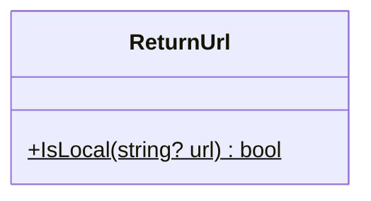

<div id="Collection-class-diagram"></div>

##### `Collection` class diagram

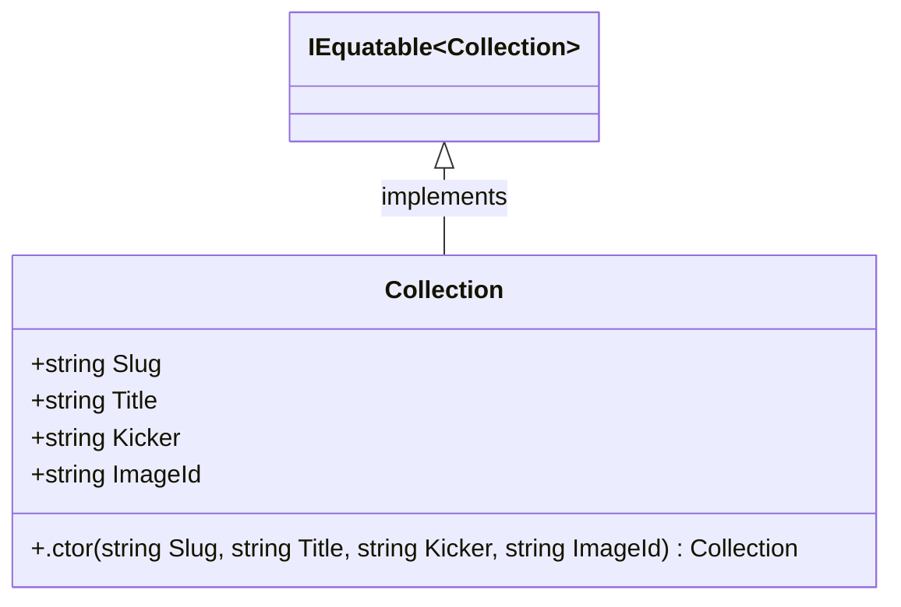

<div id="EditorialContent-class-diagram"></div>

##### `EditorialContent` class diagram

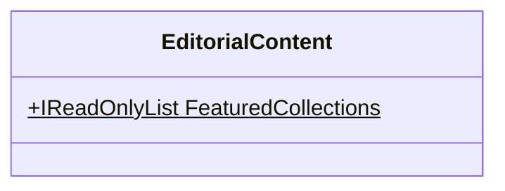

<div id="IProductCatalog-class-diagram"></div>

##### `IProductCatalog` class diagram

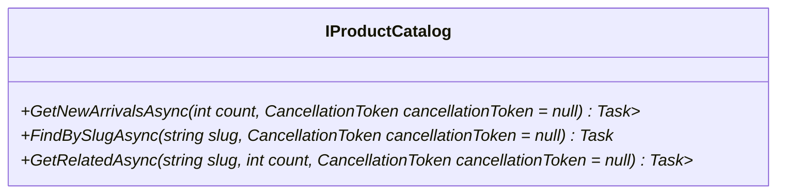

<div id="Product-class-diagram"></div>

##### `Product` class diagram

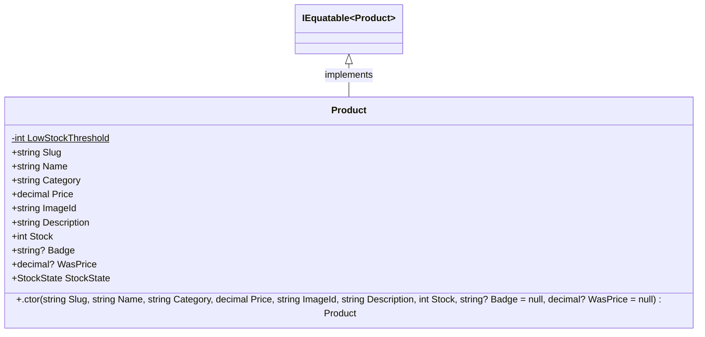

<div id="ProductCatalog-class-diagram"></div>

##### `ProductCatalog` class diagram

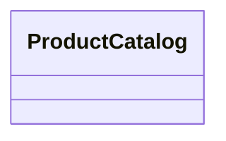

<div id="StockState-class-diagram"></div>

##### `StockState` class diagram

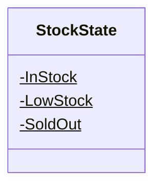

<div id="UnsplashImage-class-diagram"></div>

##### `UnsplashImage` class diagram

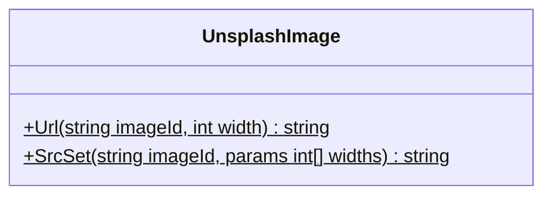

<div id="AppDbContext-class-diagram"></div>

##### `AppDbContext` class diagram

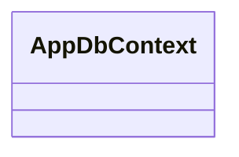

<div id="CatalogSeedData-class-diagram"></div>

##### `CatalogSeedData` class diagram

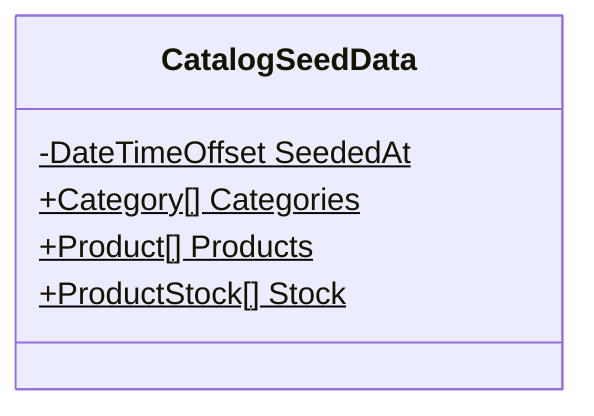

<div id="Category-class-diagram"></div>

##### `Category` class diagram

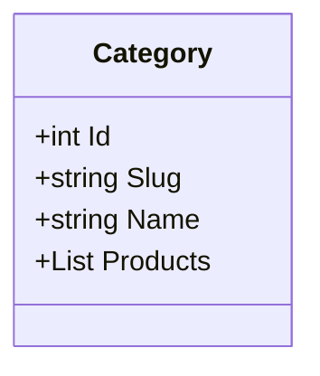

<div id="Product-class-diagram"></div>

##### `Product` class diagram

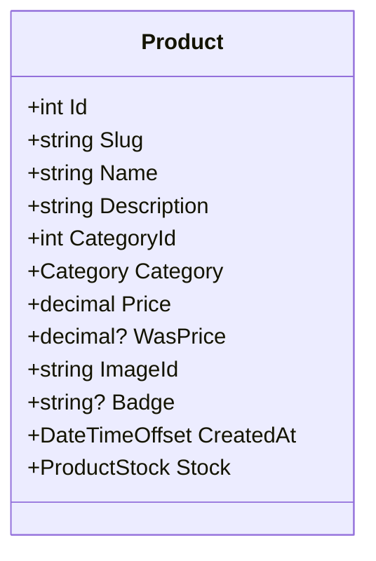

<div id="ProductStock-class-diagram"></div>

##### `ProductStock` class diagram

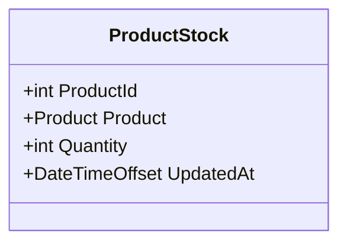

<div id="AppDbContextModelSnapshot-class-diagram"></div>

##### `AppDbContextModelSnapshot` class diagram

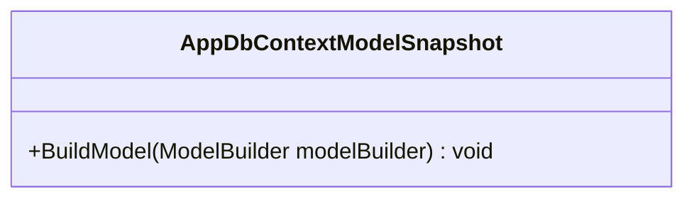

<div id="InitialCatalog-class-diagram"></div>

##### `InitialCatalog` class diagram

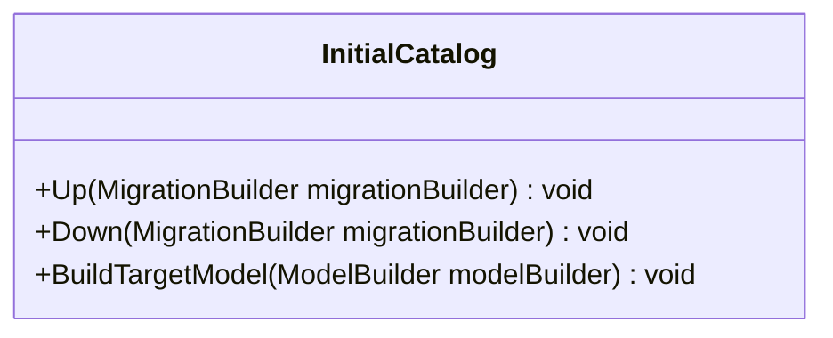

<div id="HomeTests-class-diagram"></div>

##### `HomeTests` class diagram

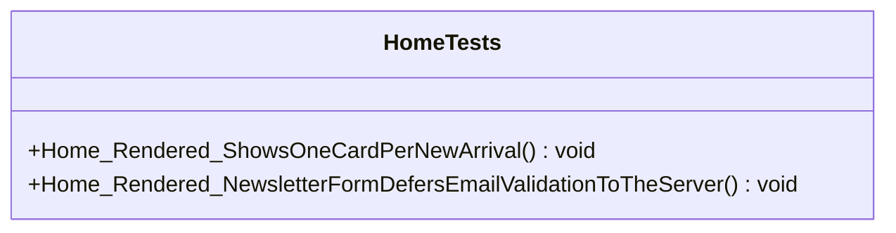

<div id="ProductCardTests-class-diagram"></div>

##### `ProductCardTests` class diagram

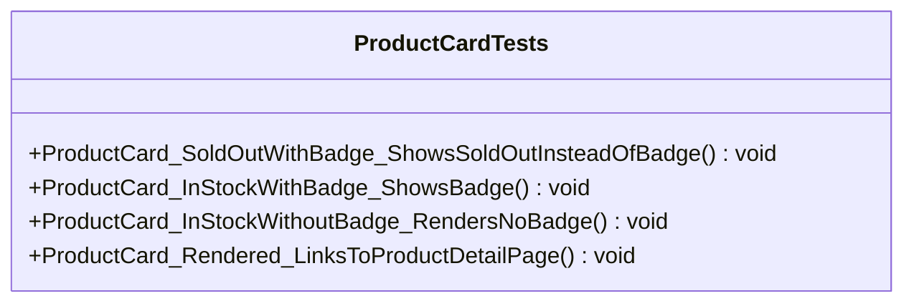

<div id="ProductDetailTests-class-diagram"></div>

##### `ProductDetailTests` class diagram

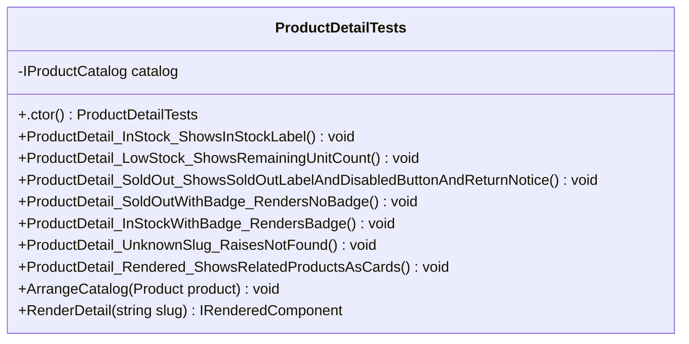

<div id="ProductPriceTests-class-diagram"></div>

##### `ProductPriceTests` class diagram

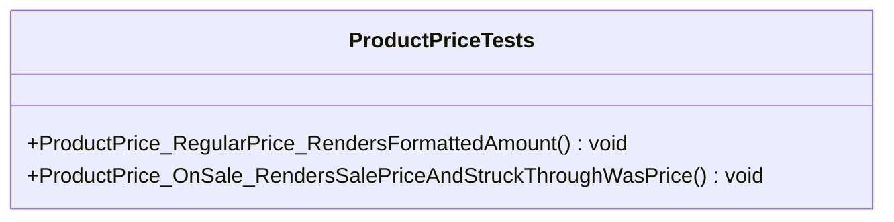

<div id="SiteHeaderTests-class-diagram"></div>

##### `SiteHeaderTests` class diagram

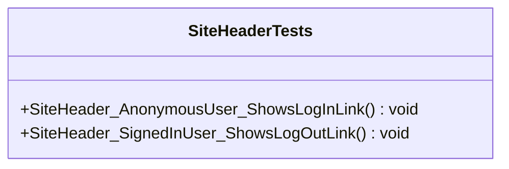

<div id="TestProducts-class-diagram"></div>

##### `TestProducts` class diagram

```mermaid
classDiagram
class TestProducts{
    +InStock(string slug = "wool-coat", string name = "Wool Coat", string category = "Outerwear", decimal price = 480, string? badge = null, decimal? wasPrice = null)$ Product
    +LowStock(int stock = 2, string slug = "wool-coat", string name = "Wool Coat")$ Product
    +SoldOut(string slug = "wool-coat", string name = "Wool Coat", string? badge = null)$ Product
}

```

<div id="AtelierAppFactory-class-diagram"></div>

##### `AtelierAppFactory` class diagram

```mermaid
classDiagram
class AtelierAppFactory{
}

```

<div id="E2ECollection-class-diagram"></div>

##### `E2ECollection` class diagram

```mermaid
classDiagram
class E2ECollection{
    -string Name$
}

```

<div id="E2EFixture-class-diagram"></div>

##### `E2EFixture` class diagram

```mermaid
classDiagram
class E2EFixture{
    -string InStockSlug$
    -string InStockName$
    -decimal InStockPrice$
    -string SoldOutSlug$
    -string SoldOutName$
    -int InStockProductId$
    -int SoldOutProductId$
    -int ReusedCategoryId$
    -PostgreSqlContainer database
    -AtelierAppFactory factory
    -IPlaywright playwright
    +IBrowser Browser
    +string BaseUrl
    +NewContextAsync(bool signedIn = false, BrowserNewContextOptions? options = null) Task<IBrowserContext>
    +InitializeAsync() ValueTask
    +DisposeAsync() ValueTask
    +MigrateAndSeedAsync(string connectionString)$ Task
}

```

<div id="PlaywrightTestBase-class-diagram"></div>

##### `PlaywrightTestBase` class diagram

```mermaid
classDiagram
class PlaywrightTestBase{
}

```

<div id="TestAuthHandler-class-diagram"></div>

##### `TestAuthHandler` class diagram

```mermaid
classDiagram
class TestAuthHandler{
}

```

<div id="AddToBagTests-class-diagram"></div>

##### `AddToBagTests` class diagram

```mermaid
classDiagram
class AddToBagTests{
}

```

<div id="AnonymousHeaderTests-class-diagram"></div>

##### `AnonymousHeaderTests` class diagram

```mermaid
classDiagram
class AnonymousHeaderTests{
}

```

<div id="HomeToProductTests-class-diagram"></div>

##### `HomeToProductTests` class diagram

```mermaid
classDiagram
class HomeToProductTests{
}

```

<div id="MobileNavTests-class-diagram"></div>

##### `MobileNavTests` class diagram

```mermaid
classDiagram
class MobileNavTests{
}

```

<div id="NewsletterTests-class-diagram"></div>

##### `NewsletterTests` class diagram

```mermaid
classDiagram
class NewsletterTests{
}

```

<div id="ProductNotFoundTests-class-diagram"></div>

##### `ProductNotFoundTests` class diagram

```mermaid
classDiagram
class ProductNotFoundTests{
}

```

<div id="SignedInHeaderTests-class-diagram"></div>

##### `SignedInHeaderTests` class diagram

```mermaid
classDiagram
class SignedInHeaderTests{
}

```

<div id="SoldOutProductTests-class-diagram"></div>

##### `SoldOutProductTests` class diagram

```mermaid
classDiagram
class SoldOutProductTests{
}

```

<div id="ReturnUrlTests-class-diagram"></div>

##### `ReturnUrlTests` class diagram

```mermaid
classDiagram
class ReturnUrlTests{
    +IsLocal_GivenUrl_ReturnsWhetherItIsRootRelative(string? url, bool expected) void
}

```

<div id="ProductStockStateTests-class-diagram"></div>

##### `ProductStockStateTests` class diagram

```mermaid
classDiagram
class ProductStockStateTests{
    +CreateProduct(int stock)$ Product
    +StockState_StockAtOrBelowZero_IsSoldOut(int stock) void
    +StockState_StockAboveZeroUpToThreshold_IsLowStock(int stock) void
    +StockState_StockAboveThreshold_IsInStock() void
}

```

<div id="UnsplashImageTests-class-diagram"></div>

##### `UnsplashImageTests` class diagram

```mermaid
classDiagram
class UnsplashImageTests{
    +Url_GivenImageIdAndWidth_BuildsResizedUnsplashUrl() void
    +SrcSet_GivenImageIdAndWidths_BuildsCommaSeparatedSrcSet() void
    +SrcSet_GivenNoWidths_ReturnsEmptyString() void
}

```

*This file is maintained by a bot.*

<!-- markdownlint-restore -->
